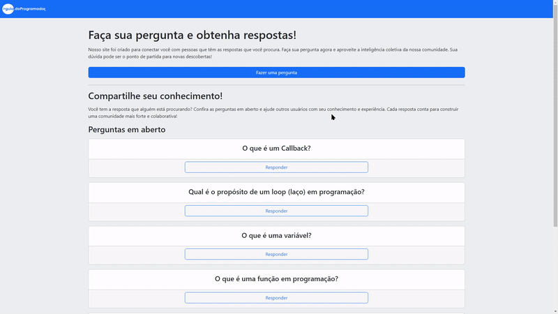

<h1 align='center'>¿ Question Page ?</h1>

<h2 align="center">
  <a href="http://206.189.231.170/">
    See the page!
  </a>
</h2>

## ❔ About

Welcome to the Question Page repository! This is a web application designed to connect you with people who have the answers to your questions. Ask and answer questions anonymously.

This application was developed as part of [@guiadoprogramador](https://www.udemy.com/course/formacao-nodejs/?couponCode=24T5MT100724)'s Node.js course, with the goal of creating a full-stack application. Users can post questions, store them in a database, and allow others to provide answers.

## 🔹 Features

- **Ask a question**: Submit a question anonymously with a title and description. The question will be stored in the database and displayed in the questions section, where others can answer it.
- **Answer a question**: Browse the questions section, where all questions are stored and displayed, with the most recent at the top. Select a question to see more details and provide an answer.

## 🔨 Tools

- [Node.js](https://nodejs.org/docs/latest/api/)
- [Express](https://expressjs.com/en/starter/installing.html)
- [Sequelize](https://sequelize.org/docs/v6/)
- [EJS](https://ejs.co/#docs)
- [MySQL](https://dev.mysql.com/doc/)

## 🔹 How to Contribute

```bash
    #Clone the project
    $ git clone https://github.com/arthurbonfim/question-page
```

```bash
    #Enter the directory
    $ cd question-page
```

```bash
    #Install the dependencies
    $ npm install
```

## 📜 License

This project is under the Unlicense. See the file [LICENSE](LICENSE.md) for more details.
